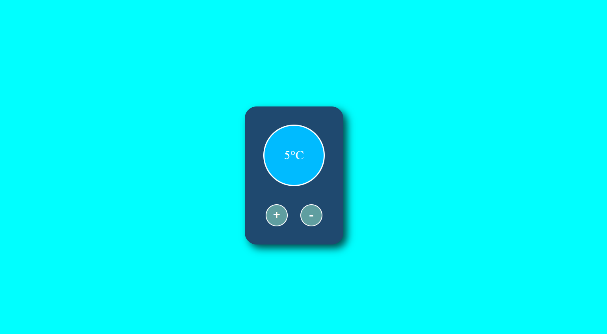

<div align="center">

# 🌡️ Temperature Converter
### Beautiful & Simple React App

<!-- Preview Image -->



<br/><br/>


</div>

---

## 📌 About The Project

**Temperature Converter** is a **beautiful and minimal React application** that allows users to easily convert temperatures between **Celsius** and **Fahrenheit** in real-time.

This project focuses on **React state management**, **controlled inputs**, and **clean UI design**.

---

## ✨ Features

- 🌡️ Convert Celsius ⇄ Fahrenheit  
- ⚡ Real-time calculation  
- 🎨 Clean & modern UI  
- 🧠 Controlled inputs with React state  
- 📱 Responsive design  

---

## 🛠 Tech Stack

| Technology | Purpose |
|----------|--------|
| React.js | UI & state management |
| JavaScript (ES6+) | Logic |
| CSS3 | Styling |
| Vite / CRA | Development setup |

---

## 📂 Project Structure

```bash
insert
├─ LICENSE
├─ package-lock.json
├─ package.json
├─ public
├─ README.md
└─ src
   ├─ App.js
   ├─ index.js
   └─ Temp
      ├─ Temp.css
      └─ Temp.js

```